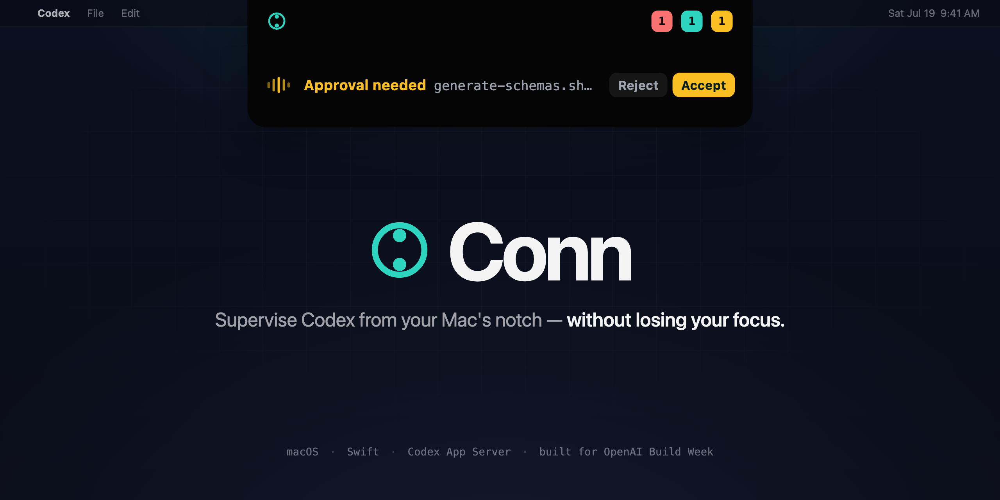

# Conn



Conn is a native macOS notch companion for supervising Codex while you work in
other apps. It shows connected thread activity, surfaces supported permission
and question requests, and lets you steer, follow up, or stop a turn without
taking ownership of the Codex process.

> [!IMPORTANT]
> Conn 0.1.0 is an alpha preview for Apple Silicon Macs running macOS 15 or
> later. It currently supports Codex CLI/App Server versions `0.144.5` and
> `0.144.6` exactly. Shared Desktop Mode is experimental and off by default.

Conn is an independent open-source project and is not an official OpenAI
product.

## What Conn does

- Keeps running, idle, completed, failed, and attention-needing threads visible
  in a compact top-center surface.
- Expands into a focused workspace for switching threads and reading recent
  structured output.
- Supports capability-gated approval, question, follow-up, steer, and stop
  actions through Codex App Server.
- Rehydrates state after reconnecting without taking ownership of Codex threads
  or their lifecycle.
- Offers an optional Labs flow for qualifying Codex Desktop and Conn as clients
  of the same managed daemon.

## Requirements

- Apple Silicon Mac. Intel builds have not been validated yet.
- macOS 15.0 or later.
- Codex installed, authenticated, and exposing CLI/App Server version `0.144.5`
  or `0.144.6`.
- Swift 6 and the Xcode Command Line Tools only when building from source.

## Install

Download the latest macOS archive from
[GitHub Releases](https://github.com/architpai/conn/releases/latest), verify the
included checksum, open the DMG, and drag Conn into Applications.

The hackathon build is ad-hoc signed because a Developer ID certificate was not
available on the build machine. macOS will therefore require an explicit
Control-click **Open** on first launch. It is not notarized. See
[INSTALL.md](INSTALL.md) for the exact binary and source installation paths,
Gatekeeper steps, supported versions, verification commands, and uninstall
instructions.

## Five-minute judge test

1. Confirm an authenticated Codex `0.144.5` or `0.144.6` standalone CLI is
   installed.
2. Install and open Conn using [INSTALL.md](INSTALL.md).
3. Leave **Shared Desktop Mode** off; Managed Daemon Mode is the default.
4. Start or resume a harmless Codex thread through the managed daemon.
5. Confirm the thread appears in Conn, expand it, and inspect its activity.
6. Send a benign follow-up or start a new chat from Conn, then confirm the turn
   continues if Conn is closed and reopened.

Conn fails closed when the App Server version is unsupported. Some approval and
question controls only appear when the connected Codex host emits the matching
request and grants Conn authority to answer it.

## Architecture

Conn is a Swift 6 menu-bar/accessory application. Its normal integration path
is:

```text
Conn.app -> codex app-server proxy --sock -> Codex-managed App Server daemon
```

The proxy is a disposable transport helper. Codex owns the daemon, threads, and
turns; quitting Conn only disconnects its client. Conn uses structured App
Server messages and does not scrape transcript files or install hooks.

The implementation is split into:

- `ConnDomain` for typed thread and turn projection.
- `ConnAppServerAdapter` for version-gated App Server transport and protocol.
- `ConnAppCore` for monitoring, persistence, presentation, and controls.
- `ConnApp` for the AppKit and SwiftUI notch surface.

Read the [architecture decisions](docs/adr),
[domain model](docs/architecture/domain-model.md), and
[operations guide](docs/managed-daemon-operations.md) for the deeper contracts.

## Privacy and safety

Conn reads structured thread, turn, item, request, and status data needed for
the visible supervision surface. It opts out of raw reasoning deltas, does not
poll transcript files, and does not enable daemon remote control. Consequential
actions are bound to the exact connection, thread, turn, and request identity.

Shared Desktop Mode uses an internal Codex Desktop switch that may change in a
future release. Its setup is explicit, reversible, current-user-only, and
documented in [docs/shared-desktop-mode.md](docs/shared-desktop-mode.md).

## Building and testing

```sh
git clone https://github.com/architpai/conn.git
cd conn
./scripts/build-app.sh

swift run conn-app-server-adapter-tests
swift run conn-domain-tests
swift run conn-app-core-tests
./scripts/test-inspect-release.sh
```

The built application is written to `.build/conn-app/Conn.app`. See
[INSTALL.md](INSTALL.md) for installation and [CONTRIBUTING.md](CONTRIBUTING.md)
for the full development workflow.

## Built with Codex and GPT-5.6

Conn was created during OpenAI Build Week, from July 18–21, 2026. GPT-5.6 in
Codex accelerated protocol research, Swift implementation, test generation,
privacy hardening, release tooling, code review, and computer-driven UI
verification.

The human-led decisions remained central: choosing the notch supervision
problem, defining the interaction design, pivoting from a hook-based prototype
to the managed App Server architecture, keeping Codex as the lifecycle owner,
setting the privacy boundary, and accepting or rejecting each implementation
and design tradeoff. The project was developed in phased Codex tasks with
explicit plans, ADRs, deterministic tests, adversarial review, and live app
checks.

## Project status and roadmap

Version 0.1.0 is a narrow alpha. Near-term priorities are Developer ID signing
and notarization, a broader and less brittle Codex compatibility strategy,
universal macOS builds, UI refinement through daily use, and voice dictation.
See [CHANGELOG.md](CHANGELOG.md) for release history.

## Contributing and security

Contributions are welcome. Start with [CONTRIBUTING.md](CONTRIBUTING.md). Please
report vulnerabilities privately as described in [SECURITY.md](SECURITY.md).

Conn is licensed under the [Apache License 2.0](LICENSE). Third-party inspiration
and generated protocol-schema provenance are recorded in
[ACKNOWLEDGEMENTS.md](ACKNOWLEDGEMENTS.md).
