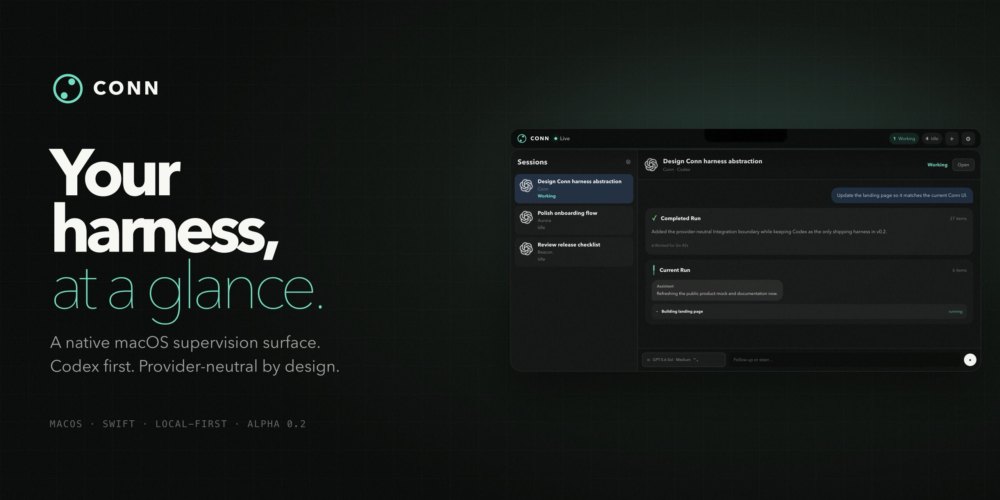

# Conn



[Visit the Conn website](https://conn-umber.vercel.app/) · [Download the latest release](https://github.com/architpai/conn/releases/latest)

Conn is a native macOS notch companion for supervising AI harness Sessions
while you work in other apps. It shows connected activity, surfaces supported
permission and question requests, and exposes only the controls that each
Integration can safely support without taking ownership of the harness process.

> [!IMPORTANT]
> Conn 0.2.1 remains an alpha preview for Apple Silicon Macs running macOS 15
> or later. Codex `0.144.5` and `0.144.6` and Pi `0.83.0` are the only
> qualified harness versions. Both Integrations are off by default and must be
> enabled explicitly in Settings. Shared Desktop Mode remains experimental.

Conn is an independent open-source project and is not an official OpenAI
product.

## What Conn does

- Keeps the Sessions in the current active and 24-hour view visible in a compact
  top-center surface, with status counts scoped to exactly that visible set.
- Expands into a focused workspace with harness attribution, Session switching,
  chronological activity, grouped Runs, full completion summaries, and elapsed
  work time.
- Supports capability-gated approval, question, follow-up, steer, interrupt,
  model, and reasoning actions through Codex App Server.
- Observes independently launched Pi TUIs through Pi's standard global
  extension and supports follow-up, steer, interrupt, model visibility, and
  idle model switching. Pi has no standard approval or question controls.
- Starts a Codex Session as a local draft in the default Workspace, with one
  compact model-and-reasoning control; Codex creates the real Session only when
  the first message is sent. External Pi Sessions must be started in Pi.
- Lets users enable Codex, Pi, both, or neither without changing the lifecycle
  of work already owned by either harness.
- Rehydrates bounded state after reconnecting without taking ownership of
  Codex or Pi Sessions and their lifecycle.
- Offers an optional Labs flow for qualifying Codex Desktop and Conn as clients
  of the same managed daemon.

## Requirements

- Apple Silicon Mac. Intel builds have not been validated yet.
- macOS 15.0 or later.
- At least one qualified harness:
  - Codex installed, authenticated, and exposing CLI/App Server version
    `0.144.5` or `0.144.6`.
  - Pi `0.83.0` installed with the Node runtime that provides the `pi` command.
- Swift 6 and the Xcode Command Line Tools only when building from source.

## Install

Download the latest macOS archive from
[GitHub Releases](https://github.com/architpai/conn/releases/latest), verify the
included checksum, open the DMG, and drag Conn into Applications.

The current alpha build is ad-hoc signed. macOS will therefore require an
explicit Control-click **Open** on first launch, and **Launch Conn at login**
cannot be registered by this artifact. Developer ID signing and notarization
are planned before Conn leaves alpha. See
[INSTALL.md](INSTALL.md) for the exact binary and source installation paths,
Gatekeeper steps, supported versions, verification commands, and uninstall
instructions.

## Five-minute smoke test

1. Confirm an authenticated Codex `0.144.5` or `0.144.6`, Pi `0.83.0`, or both
   are installed.
2. Install and open Conn using [INSTALL.md](INSTALL.md).
3. Open Settings and explicitly enable the Integration you want to test. Pi
   setup installs Conn's extension after confirmation; already-open TUIs need
   one `/reload`.
4. For Codex, leave **Shared Desktop Mode** off and start or resume a harmless
   Session through the managed daemon. For Pi, start a harmless TUI Session.
5. Confirm the Session appears with the correct harness mark, model, status,
   and transcript.
6. Send a benign follow-up or steer while active, then verify interrupt on a
   disposable Run.
7. For Codex, verify draft-first New Session. For an idle Pi Session, verify an
   available model can be selected before the next follow-up.

Conn fails closed when a harness version is unsupported. Approval and question
controls only appear when Codex emits a matching request and grants Conn
authority to answer it; Conn does not invent equivalents for customized Pi
tools.

## Architecture

Conn is a Swift 6 menu-bar/accessory application. Its normal integration path
has two adapter-owned paths:

```text
Conn.app -> codex app-server proxy --sock -> Codex-managed App Server daemon
Conn.app <- bounded local socket <- Conn Pi extension <- external Pi TUI
```

The Codex proxy is disposable; Codex owns the daemon, threads, and turns. The
Pi extension reports bounded structured state and accepts acknowledged
commands; Pi owns its TUI, Session, and runtime. Quitting or disabling Conn
does not stop either harness.

The provider-neutral implementation is split into:

- `ConnDomain` for Harness, Integration, Session, Run, Activity, Attention, and
  action semantics.
- `ConnAppCore` for Integration aggregation, persistence, presentation, and
  policy.
- `ConnCodexAdapter` for the version-gated Codex App Server implementation.
- `ConnPiAdapter` for the version-gated external Pi extension and local broker.
- `ConnUI` for the provider-neutral AppKit and SwiftUI notch surface.
- `ConnApp` for opt-in Integration composition, setup, and migration controls.

Read the [architecture decisions](docs/adr),
[domain model](docs/architecture/domain-model.md), and
[operations guide](docs/managed-daemon-operations.md) for the deeper contracts.

## Privacy and safety

Conn reads bounded structured Session, Run, Activity, request, model, and status
data needed for the visible supervision surface. The Pi broker is current-user
local and validates bounded identities and acknowledgements. Conn does not poll
transcript files, enable daemon remote control, or claim lifecycle ownership.
Consequential actions remain bound to the exact Integration and Session
identity.

Shared Desktop Mode uses an internal Codex Desktop switch that may change in a
future release. Its setup is explicit, reversible, current-user-only, and
documented in [docs/shared-desktop-mode.md](docs/shared-desktop-mode.md).

## Building and testing

```sh
git clone https://github.com/architpai/conn.git
cd conn
./scripts/build-app.sh

swift run conn-codex-adapter-tests
swift run conn-pi-adapter-tests
swift run conn-domain-tests
swift run conn-app-core-tests
swift run conn-ui-tests
pnpm pi:typecheck
pnpm --filter @conn/pi-extension test
./scripts/test-inspect-release.sh
```

The built application is written to `.build/conn-app/Conn.app`. See
[INSTALL.md](INSTALL.md) for installation and [CONTRIBUTING.md](CONTRIBUTING.md)
for the full development workflow.

## Built with Codex and GPT-5.6

Conn was created during OpenAI Build Week, from July 18–21, 2026. GPT-5.6 in
Codex accelerated protocol research, Swift implementation, test generation,
privacy hardening, release tooling, code review, and computer-driven UI
verification.

The human-led decisions remained central: choosing the notch supervision
problem, defining the interaction design, pivoting from a hook-based prototype
to the managed App Server architecture, keeping Codex as the lifecycle owner,
setting the privacy boundary, and accepting or rejecting each implementation
and design tradeoff. The project was developed in phased Codex tasks with
explicit plans, ADRs, deterministic tests, adversarial review, and live app
checks.

## Project status and roadmap

Version 0.2.1 is a continued alpha. It ships qualified Codex and external Pi
Integrations on the provider-neutral Session model. Claude Code, OpenCode, and
other harnesses are not supported. External Pi creation, approval, and question
controls remain out of scope. Near-term priorities remain Developer ID signing
and notarization, broader adapter qualification, universal macOS builds, and
UI refinement through daily use.
See [CHANGELOG.md](CHANGELOG.md) for release history.

## Contributing and security

Contributions are welcome. Start with [CONTRIBUTING.md](CONTRIBUTING.md). Please
report vulnerabilities privately as described in [SECURITY.md](SECURITY.md).

Conn is licensed under the [Apache License 2.0](LICENSE). Third-party inspiration
and generated protocol-schema provenance are recorded in
[ACKNOWLEDGEMENTS.md](ACKNOWLEDGEMENTS.md).
